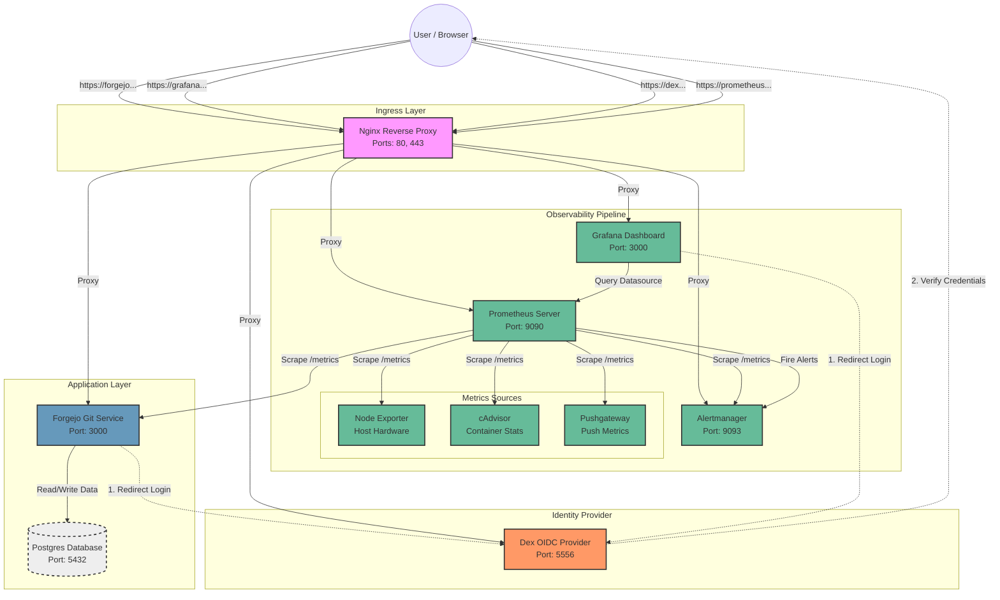

# System Architecture & Service Interconnections

This document outlines the architecture of the Application Monitoring and SSO Stack. It details how services interact, communicate, and depend on one another.

## Visual Diagram

The following Mermaid graph illustrates the traffic flow (Ingress), authentication (SSO), data persistence, and the monitoring pipeline.

## Service Details

### 1. Gateway (Nginx)
- **Role**: Entry point for all external traffic.
- **Function**: Routes HTTP/HTTPS requests based on domains (`forgejo.local`, `grafana.local`, etc.) to the appropriate internal container.
- **Dependencies**: None (it routes to others).

### 2. Authentication (Dex)
- **Role**: Centralized Identity Provider (IdP).
- **Function**: Handles user login and issues tokens (OIDC).
- **Interactions**:
    - **Forgejo** and **Grafana** connect to Dex to authenticate users.

### 3. Application (Forgejo & Postgres)
- **Forgejo**: Self-hosted Git service.
    - Connects to **Postgres** for data storage.
    - Connects to **Dex** for user login (SSO).
- **Postgres**: Database backend. Only accessible internally by Forgejo.

### 4. Monitoring (Prometheus, Grafana, & Exporters)
- **Prometheus**: Metrics collection engine.
    - **Scrapes** (pulls data) from `Node Exporter`, `cAdvisor`, `Pushgateway`, and other targets every 15s.
    - Sends alert rules to **Alertmanager**.
- **Grafana**: Visualization dashboard.
    - Queries **Prometheus** to display graphs.
    - Uses **Dex** for login.
- **Alertmanager**: Handles alert notifications (e-mail, Slack, etc.) received from Prometheus.
- **Exporters**:
    - **Node Exporter**: Exposes Host OS metrics (CPU, RAM, Disk).
    - **cAdvisor**: Exposes Docker Container metrics.
