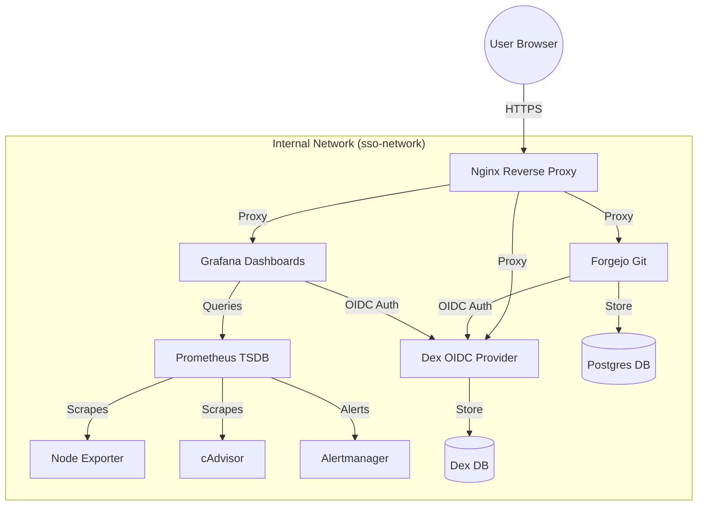

# Comprehensive Project Explanation Guide: VCC 2025

This document provides a detailed, step-by-step breakdown of the Monitoring & SSO stack. It covers everything from initial environment setup to the interaction between individual services.

---

## 1. Environment Setup (`setup-environment.sh`)

The `setup-environment.sh` script is the foundation of the project. Its primary goal is to transform a "raw" Linux server (like Ubuntu) into a ready-to-run Docker Swarm node.

### Core Functions:
1.  **System Detection**: It identifies your OS (Ubuntu, Debian, etc.) and sets the appropriate package manager (`apt`, `yum`).
2.  **Requirement Checks**: verifies that you have enough RAM (at least 2GB) and disk space (at least 10GB).
3.  **Docker Installation**:
    ```bash
    # snippet from setup-environment.sh
    sudo apt-get install -y docker-ce docker-ce-cli containerd.io docker-compose-plugin
    ```
    It installs the Docker engine and the modern Compose plugin.
4.  **Firewall Configuration**: It opens the specific ports required for **Docker Swarm** gossip and data traffic:
    - `2377/tcp`: Cluster management
    - `7946/tcp/udp`: Node discovery
    - `4789/udp`: Overlay network traffic
5.  **Project Structure**: Creates the directory tree (`nginx/certs`, `.data/postgres`, etc.) so that volume mounts don't fail later.

---

## 2. Deployment Script (`deploy-local.sh`)

Once the environment is ready, `./deploy-local.sh` handles the orchestration of the stack.

### Step-by-Step Workflow:
1.  **Swarm Initialization**: Checks if Swarm is active; if not, it runs `docker swarm init`.
2.  **Certificate Generation**: Calls `scripts/generate-certs.sh` to create self-signed TLS certificates for HTTPS.
3.  **Hosts File Setup**: Maps local domains like `grafana.local` to `127.0.0.1` in your `/etc/hosts`.
4.  **Stack Deployment**:
    ```bash
    docker stack deploy -c docker-compose.swarm.yml sso
    ```
    This is the core command that tells Docker Swarm to read the YAML file and start the services.

---

## 3. Docker Swarm Configuration (`docker-compose.swarm.yml`)

This file is the "blueprint" of the entire system. Let's break down the key parts of the code:

### Network & Volumes
```yaml
networks:
  sso-network:
    driver: overlay # Essential for Swarm; allows containers on different nodes to talk.

# We use local Bind Mounts for persistence (data stays in your project folder)
# These folders are created by deploy-local.sh
```

### Key Services Breakdown:

#### **Nginx (The Gatekeeper)**
Nginx acts as the **Reverse Proxy**. It is the only service exposed on ports 80 and 443.
```yaml
    ports:
      - "80:80"
      - "443:443"
    volumes:
      - ./nginx/conf.d/local.conf:/etc/nginx/conf.d/default.conf
      - ./nginx/certs:/etc/nginx/certs:ro # Mounts the SSL certs we generated.
```

#### **Forgejo (The Git Service)**
Forgejo is configured via environment variables. Note how it's linked to the database:
```yaml
      - FORGEJO__database__HOST=postgres:5432
      - FORGEJO__server__ROOT_URL=https://forgejo.local
```

#### **Grafana (The Dashboard)**
Grafana is integrated with **Dex** for SSO (Single Sign-On).
```yaml
      - GF_AUTH_GENERIC_OAUTH_AUTH_URL=https://dex.local/dex/auth
      - GF_AUTH_GENERIC_OAUTH_TLS_SKIP_VERIFY_INSECURE=true # Allows trusting our self-signed cert.
```

---

## 4. Service Interaction & Roles

This stack implementation follows a "Single Sign-On + Monitoring" architecture.

### Interaction Diagram (Mermaid)



### Roles of Each Service:
-   **cAdvisor**: Analyzes resource usage (CPU, Memory) of all **running containers**.
-   **Node Exporter**: Analyzes resource usage of the **host machine** (operating system).
-   **Prometheus**: The "collector". It periodically asks cAdvisor and Node Exporter for their metrics and stores them.
-   **Grafana**: The "visualizer". It pulls data from Prometheus to draw beautiful graphs.
-   **Alertmanager**: The "watchdog". If Prometheus detects shared metrics (e.g., CPU > 90%), Alertmanager handles the notification logic.
-   **Forgejo**: Your private Git repository service.
-   **Dex**: The Identity Provider. It allows you to log into both Forgejo and Grafana with a single set of credentials (`admin@local`).

---

## 5. HTTPS/TLS Logic

We implemented TLS to ensure that passwords and OIDC tokens are never sent in plain text.

1.  **Generation**: We use `openssl` to create a root CA. This CA then signs a wildcard certificate (`*.local`).
2.  **Termination**: Nginx receives the HTTPS traffic, decrypts it using the certificate, and then forwards the traffic as HTTP to the internal services (Grafana, Forgejo).
3.  **Trust**: Since browsers don't know our Root CA, you see a "Warning". Internally, we set `SKIP_TLS_VERIFY=true` in Grafana and Forgejo so they don't block their own communication with Dex.

---

*This guide was generated for the VCC 2025 project preparation.*
